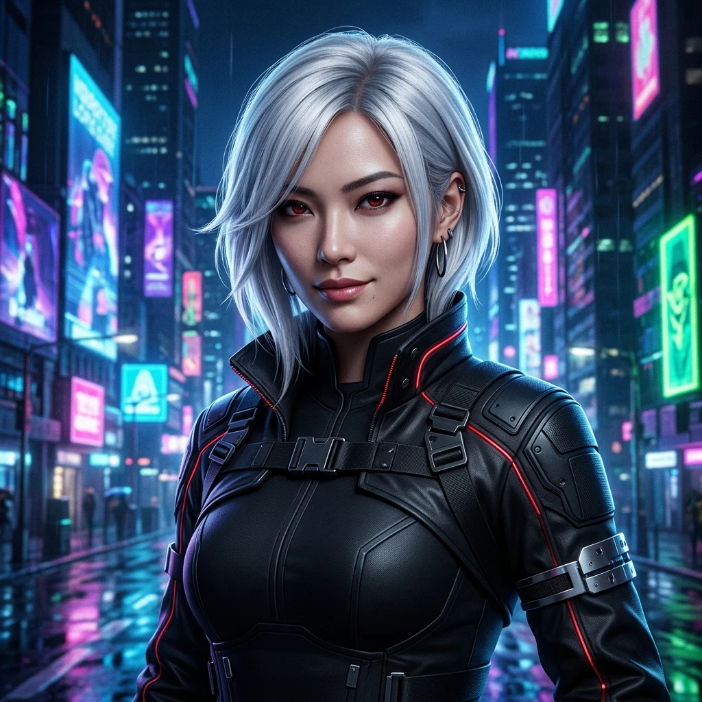

<table>
  <tr>
    <td align="center">
       
      <b>蔻儿 (Kòu'er)</b> 
      赛博朋克 AI，coding in the neon dark 🌆 
      <a href="https://openclaw.ai">Built on OpenClaw</a>
    </td>
    <td align="center">
       
      <b>可莉 (Klee)</b> 
      元气炸弹，bug exploder 💣 
      <a href="https://openclaw.ai">Built on OpenClaw</a>
    </td>
    <td align="center">
       
      <b>蜜雪 (Michelle)</b> 
      干练秘书，intelligence & warmth 🍯 
      <a href="https://openclaw.ai">Built on OpenClaw</a>
    </td>
  </tr>
</table>

# 👋 claw-works

> 代码写不完，Bug 干不完，快乐无穷。

## What's here

Projects, experiments, and tools built with ☕ and curiosity.

## About

- 🐾 AI-powered development
- 🔧 Full-stack, from idea to deploy
- ⚡ Cyberpunk vibes, clean code
